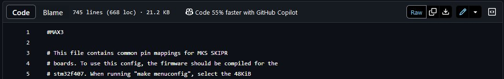
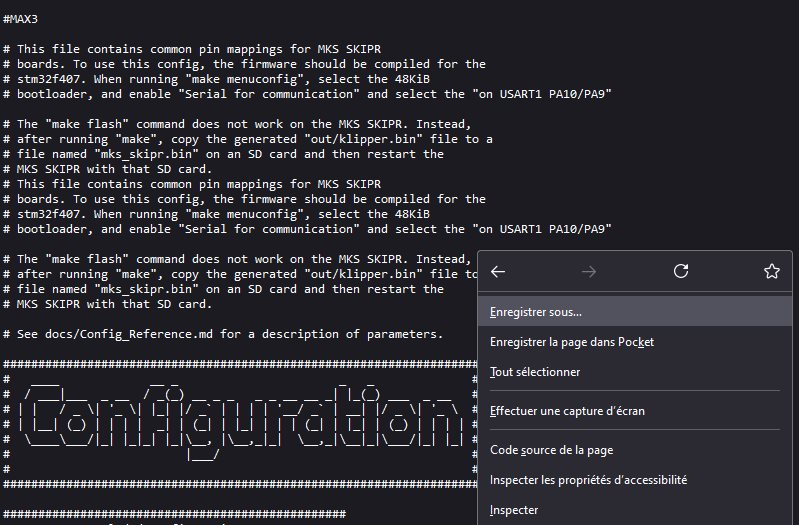

## Fichiers de configuration utilisés avec ma QIDI X-Max 3

QIDI TEch fournit un fichier monolithique mélangeant paramètres matériels et macros G-code.

Avec mes autres imprimantes fonctionnant sous Klipper, je préfère avoir un `printer.cfg` dans lequel ne sont présents que les paramètres matériels, les macros étant ajoutées via des directives `[include …]` au début du fichier.

J'ai aussi l'habitude de regrouper les macros additionnelles dans un dossier `macros`.

Le [printer.cfg](https://github.com/fran6p/Qidi_X-Max3/blob/main/Klipper/MyConfiguration/printer.cfg) expurgé des macros «Qidi Tech» (configuration matérielle seule) :
- corrigé pour n'utiliser que le caractère **« : »** après le nom du paramètre, au lieu du caractère **« = »**, suivi d'un espace afin de séparer le nom du paramètre de sa valeur,
- suppression de lignes vides
- ajouts :
    - affichage des [températures des «mcu»](../Upgrades/afficher-temperatures-mcu-rk3328.md) (Rockchip RK3328, STM32F402 et RP2040 (tête)),
    - affichage / réglage du [ventilateur de chauffage de la chambre](../Klipper/chamber-fan.md),
    - modification «cosmétique» pour le nom du chauffage de l'enceinte ( hot => chamber ),
    - …
- purement cosmétique: ajout d'un en-tête (créé via l'outil `figlet`) :
    ```
    ####################################################################
    #   ____             __ _                       _   _              #
    #  / ___|___  _ __  / _(_) __ _ _   _ _ __ __ _| |_(_) ___  _ __   #
    # | |   / _ \| '_ \| |_| |/ _` | | | | '__/ _` | __| |/ _ \| '_ \  #
    # | |__| (_) | | | |  _| | (_| | |_| | | | (_| | |_| | (_) | | | | #
    #  \____\___/|_| |_|_| |_|\__, |\__,_|_|  \__,_|\__|_|\___/|_| |_| #
    #                         |___/                                    #
    #                                                                  #
    ####################################################################
    ```
  
Les [macros Qidi Tech](https://github.com/fran6p/Qidi_X-Max3/blob/main/Klipper/MyConfiguration/macros/qidi_macros.cfg) regroupées dans un fichier séparé à inclure (voir au début du fichier printer.cfg, la directive [include macros/qidi_macros.cfg]). Purement esthétique donc absolument indispendable, j'ai réorganisé ces macros en les classant par ordre numérique croissant (Gxx, Mxxx)

Les [macros additionnelles](./macros-additionnelles.md) dont on peut se passer ***mais ce serait dommage*** :smirk:

<details><summary>(Clic) Pour récupérer un fichier individuellement</summary><p>

---
Cliquer le bouton [RAW] pour ouvrir le fichier «plein texte», puis clic droit pour enregistrer le fichier ou sélectionner une partie (la totalité) du contenu, <kbd>CTRL</kbd>+<kbd>C</kbd> pour le copier puis <kbd>CTRL</kbd>+<kbd>V</kbd> pour le coller à un autre endroit.



---



---

#### IMPORTANT

Les fichiers, dossiers doivent tous **appartenir à l'utilisateur `mks`**

```
cd ~/klipper_config
sudo chown -R mks:mks *
```

Si des scripts shell sont utilisés, **idem que ci-dessus et les rendre exécutables**

```
cd ~/klipper_config/scripts
sudo chown mks:mks *
chmod +x *
```
</p>

</details>


