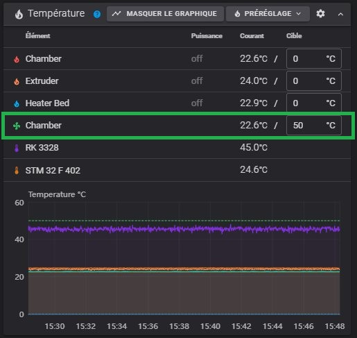

## Ventilation de l'extraction d'air

L'ajout d'une section `[temperature_fan xxx]` permet l'activation du ventilateur d'extraction d'air quand le capteur associé est au-dessus d'une température définie [voir ici](https://www.klipper3d.org/fr/Config_Reference.html#temperature_fan)

Le ventilateur d'extraction d'air correspond au «fan3» :

```
[output_pin fan3]
pin: PC9
pwm: True
cycle_time: 0.0100
hardware_pwm: false
value: 0.0
scale: 255
shutdown_value: 0.0
```

La surveillance de la température (**à ajouter dans le printer.cfg**) s'effectue à l'aide de cette section :

```
[temperature_fan chamber] #fan3
pin: PC9
max_power: 1
#shutdown_speed:
#cycle_time:
hardware_pwm: false
#kick_start_time:
off_below:.1
sensor_type: NTC 100K MGB18-104F39050L32
sensor_pin: PA1
control: pid
pid_kp: 60
pid_ki: 1
pid_kd: 900
pid_deriv_time: 120
min_temp: 0
max_temp: 90
target_temp: 50.0
max_speed: 1
min_speed: 0.0
gcode_id: chamber #hot
```

Le chauffage de l'enceinte est réglé via la section `[heater_generic …]` ([documentation Klipper](https://www.klipper3d.org/fr/Config_Reference.html#heater_generic)).

```
[heater_generic chamber]
#[heater_generic hot] ; Qidi
# changement du nom "hot" par "chamber" plus explicite
#gcode_id:
heater_pin: PB10
max_power: 1.0
sensor_type: NTC 100K MGB18-104F39050L32
sensor_pin: PA1
control: watermark
max_delta: 1.0
#pid_Kp: 63.418 
#pid_Ki: 1.342 
#pid_Kd: 749.125
min_temp: -100
max_temp: 70
```

La section `[temperature_fan chamber]` utilise des broches déjà définies (PA1, PC9) dans les sections `[output_pin fan3] et [heater_generic chamber]`. La [section suivante](https://www.klipper3d.org/fr/Config_Reference.html#duplicate_pin_override) (**à ajouter dans le printer.cfg**) permet d'éviter l'affichage d'une erreur :

```
[duplicate_pin_override]
pins: PA1,PC9
```

Après redémarrage de Klipper, une nouvelle ligne s'affiche dans la section «**Température**» de Fluidd :



