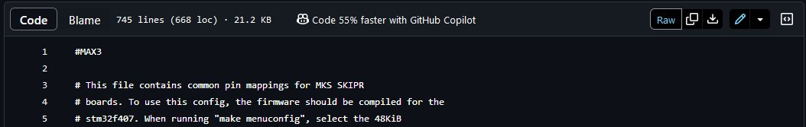

## Fichiers de configuration utilisés avec ma QIDI X-Max 3

QIDI TEch fournit un fichier monolithique mélangeant paramètres matériels et macros G-code.

Avec mes autres imprimantes fonctionnant sous Klipper, je préfère avoir un `printer.cfg` dans lequel ne sont présents que les paramètres matériels, les macros étant ajoutées via des directives `[include …]` au début du fichier.

J'ai aussi l'habitude de regrouper les macros additionnelles dans un dossier `macros`.

Le printer.cfg expurgé des macros «Qidi Tech» (configuration matérielle seule) :
- corrigé pour n'utiliser que le caractère **« : »** après le nom du paramètre, au lieu du caractère **« = »**, suivi d'un espace afin de séparer le nom du paramètre de sa valeur,
- suppression de lignes vides

  
(Cliquez pour agrandir!)

[printer.cfg](https://github.com/fran6p/Qidi_X-Max3/blob/main/Klipper/MyConfiguration/printer.cfg)

 

  
Les macros Qidi Tech regroupées dans un fichier séparé à inclure `qidi_macros.cfg` (voir au début du fichier printer.cfg, la directive [include macros/qidi_macros.cfg]). Purement esthétique donc absolument indispendable, j'ai réorganisé ces macros en les classant par ordre numérique croissant (Gxx, Mxxx) :

  
(Cliquez pour agrandir!)

[macros QidiTech](https://github.com/fran6p/Qidi_X-Max3/blob/main/Klipper/MyConfiguration/macros/qidi_macros.cfg)

 

 
Cliquer le bouton [RAW] pour ouvrir le fichier «plein texte», puis clic droit pour enregistrer le fichier ou sélectionner une partie (la totalité) du contenu, CTRL+C pour le copier / coller à un autre endroit.

:smirk:

