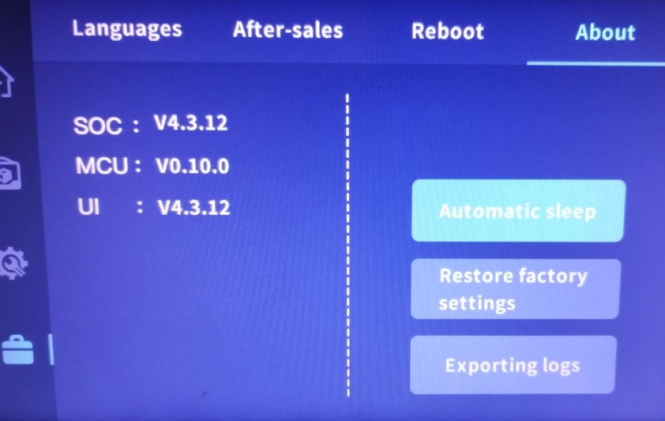

# Modifications entre V4.3.10 et V4.3.12

Qidi a mis à jour le firmware fin novembre 2023. Disponible sur [le github](https://github.com/QIDITECH/QIDI_MAX3/releases/tag/Max3_V4.3.12), devrait l'être également d'ici quelques jours sur [le site](https://qidi3d.com/pages/software-firmware)

<details><summary>Traduction des notes de la release v4.3.12</summary><p>

MISE À JOUR DES FONCTIONNALITÉS

- Amélioration du chargement/déchargement du filament pendant l'impression : Modification de la logique de chargement et de déchargement du filament. Pour le déchargement, une invite à couper le filament est affichée.
- Modification des distances de chargement du filament : Les options pour les distances de chargement de filament sont maintenant 20mm, 50mm et 100mm.
- Suppression des fichiers de cache d'impression précédents lors de la mise à jour : la mise à jour supprime désormais automatiquement les fichiers de cache d'impression précédemment stockés.
- Mise à jour des paramètres de sauvegarde par défaut : Par défaut, la détection de présence du filament sera activée après la mise à jour.
- Préservation des valeurs de compensation d'origine (zoffset) : Les valeurs de compensation dans klipper_config/configuration seront conservées après la mise à jour.
- Suppression de la dernière distance de déplacement dans l'enregistrement du nivellement : Le processus de nivellement démarre désormais à partir d'une distance de déplacement nulle.
- Modifications de la fonctionnalité WIFI cachée : L'interface comprend désormais une option permettant de saisir un réseau WIFI caché.

MISE À JOUR DE L'INTERFACE UTILISATEUR

- Modifications de l'interface utilisateur pour la détection de présence du filament : Modification des icônes de l'interface correspondant à l'état d'activation/désactivation pendant l'impression.
- Notification de mémoire pleine : Ajout d'une notification lorsque la mémoire est pleine.
- Ajout d'une interface de "mise à jour" : Ajout d'un écran d'interface qui s'affiche pendant les mises à jour.

CORRECTION DE BOGUES

- Correction de l'écran figé après la séquence de nivellement : Suppression de la vérification conditionnelle après avoir appuyé sur le bouton, permettant une transition inconditionnelle vers l'écran suivant.

</details>

## Paramètres imprimantes

- la version passe en V4.3.11 (devrait plutôt être V4.3.12)
- [extruder] la distance d'extrusion maximale est augmentée de 100 à 120 mm
  ```
  max_extrude_only_distance: 120.0
  ```
- [stepper_z] la vitesse de mise à l'origine est diminuée de 10 à 8 mm/s
  ```
  homing_speed: 8
  ```
- [homing_override] la vitesse de mise à l'origine est diminuée de 10 à 8 mm/s (F600 à F480)
  ```
  G1 Z20 F480 
  ```
- ajout de deux sections [heater_fan …] (***avec une légère erreur de nommage***)
  ```
 	[heater_fan hotend_fan2] 		 
	pin: MKS_THR:gpio20 		 
	max_power: 1.0 		 
	kick_start_time: 0.5 		 
	heater: extruder 		 
	heater_temp: 50.0 		 
	fan_speed: 1.0 		 
	off_below: 0 		 
	  		 
	[heater_fan borad_fan] 	# devrait plutôt être «board_fan»	 
	pin: PC4 		 
	max_power: 1.0 		 
	kick_start_time: 0.5 		 
	heater: extruder 		 
	heater_temp: 50.0 		 
	fan_speed: 1.0 		 
	off_below: 0
  ```
  Ainsi ces deux ventilateurs affichent leur status dans l'interface Fluidd
- [idle_timeout] modification de la durée de veille à 24h (86400s)
  ```
  timeout: 86400
  ```
- suppression de la section [mcu rpi] permettant l'affichage de la température du contrôleur RK3328 dans Fluidd
  ```
  [mcu rpi]
	serial: /tmp/klipper_host_mcu
  ```
               
## Macros

- [gcode_macro PAUSE] modification de la durée de veille de 12h à 24h
  ```
  SET_IDLE_TIMEOUT TIMEOUT=86400 
  ```
- ajout du M191, attendre que la chambre atteigne la température cible.
  ```
  [gcode_macro M191] 		 
  gcode:
    #Parameters 		 
     		       		 
    M141 {'%s%s' % (p, params[p])}  ; Set hotend temp 		 
     		 
      TEMPERATURE_WAIT SENSOR="heater_generic hot" MINIMUM={s} MAXIMUM={s+1}   ; Wait for hotend temp (within 1 degree) 		 
           		 
	
  ```
- La macro M603 est modifiée **mais avec une erreur, le filament est poussé au lieu d'être rétracté** (au lieu de G0 E100 il faudrait G0 E-100)… Idem pour le nommage «unlode» au lieu de «unload»
  ```
  [gcode_macro M603]
  description: filament unlode
  gcode:
    G92 E0
    G0  E100 F400
  ```
- ajout du M604, chargement du filament (même erreur de nommage «lode» vs «load»)
  ```
  [gcode_macro M604] 		 
  description: filament lode 		 
  gcode: 		 
    M83 		 
    G1  E80 F400
  ```      

Voilà, c'est tout pour aujourd'hui :smiley:


