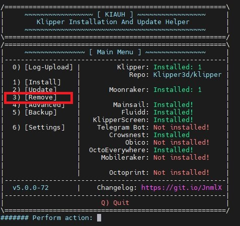
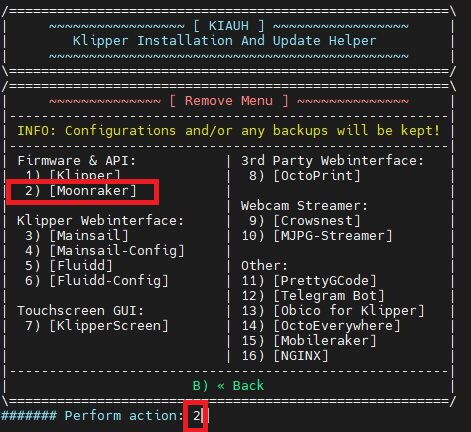
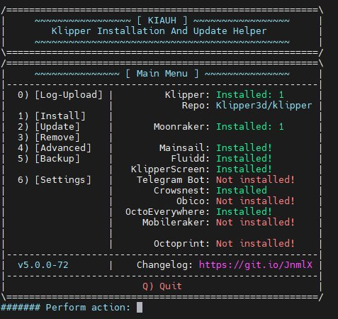
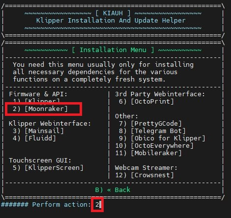
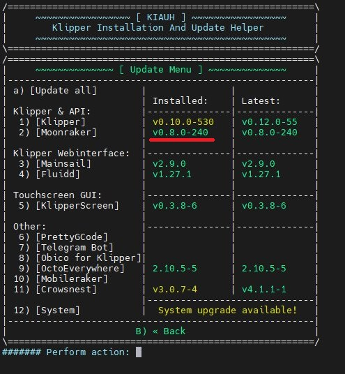

# Mise à jour de Moonraker

La version originelle installée dans le système date un peu (**v0.7.1-609**). 

Comme tout logiciel, Moonraker évolue. Les dernières versions apportent des nouveautés, par exemple [Spoolman](https://github.com/Donkie/Spoolman) (gestionnaire de bobines de filament). 

En fin d'année dernière (2022), un profond changement a également eu lieu.

L'ensemble des fichiers auparavant éparpillés dans des dossiers à la racine du répertoire de l'utilisateur :
```
~/klipper_config
~/gcode_files
~/klipper_logs
~/.moonraker_database
```

sont désormais regroupés dans un seul dossier (**~/printer_data**).

Ce dernier contient d'autres dossiers :
- certs
- comms
- config
- database
- gcodes
- logs
- systemd

Pour plus d'informations, voir la pull request d'Arksine à ce propos : [Moonraker pull request d'Octobre 2022 ](https://github.com/Arksine/moonraker/pull/491)

L'idéal serait qu'une mise à jour la plus simple soit possible **sans casser le système**. C'est normalement prévu par Moonraker… A condition que le dossier Moonraker/moonraker n'ait pas été modifié (ce qui n'est pas le cas de la version MKS / QIDI Tech).

Ayant l'habitude d'utiliser [KIAUH](https://github.com/dw-0/kiauh) pour procéder aux mises à jour des composants (Fluidd, Mainsail, KlipperScreen, OctoEverywhere), ma tentative de mise à jour de Moonraker se solde par un échec. Des fichiers ayant été modifiés, la mise à jour ne peut se faire :
- moonraker/components/file_manager/metadata.py
- moonraker/components/klippy_apis.py
- moonraker/components/machine.py

## Que faire ?

N'étant plus tout jeune, le principe «***ceinture et bretelles***» m'est coutumier. J'avais déjà procédé à une sauvegarde complète du dossier de l'utilisateur **mks**. Je peux donc, toujours via KIAUH, supprimer l'installation actuelle de Moonraker.

1. `./kiauh/kiauh.sh`
   


2. Choix de l'option 3 (Remove), valider, puis choix 2 pour supprimer Moonraker
   


3. Une fois cette suppression réalisée, revenir au menu principal en tapant **b** (back)



4. Choix de l'option 1 (Install) pour procéder à l'installation de Moonraker (option 2):



> L'installation prend un peu de temps, le temps de récupérer, compiler les composants nécessaires au fonctionnement de Moonraker (pip, wheel, …)

5. Une fois finie l'installation, le service Moonraker est redémarré. Retour au menu principal de KIAUH, choix de l'option 2 (Update) pour afficher les versions des différents composants.



Reste à vérifier que le système fonctionne encore. Pour cela, le mieux est de passer par l'interface Web Fluidd (http://ip-xmax3:10088).

Fluidd me signale des erreurs : **Klipper ne peut démarrer**.

C'est parfaitement normal car le dossier **~/printer_data/config** ne contient pour le moment que le fichier **moonraker.conf** (*les fichiers de configuration se trouvent toujours dans l'ancien emplacememt* **~/klipper_config**).

Avant de poursuivre, déplacer le fichier **moonraker.conf** du dossier **~/printer_data/config** dans le dossier **~/klipper_config** sous un autre nom :
```
sudo systemctl stop moonraker
mv ~/printer_data/config/moonraker.conf ~/klipper_config/moonraker.conf.new
```

Deux choix s'offrent à nous :
1. déplacer le contenu des dossiers existants vers le chemin de données ~/printer_data/{config|database|logs|gcodes}
2. ou créer des liens symboliques dans ~/printer_data après avoir supprimé les dossiers actuels {config|database|logs|gcodes}

J'opte pour le choix 2 (***création de liens symboliques***) :

```
sudo systemctl stop moonraker
cd ~/printer_data
rm -rf config
rm -rf logs
rm -rf database
rm -rf gcodes
ln -s ~/klipper_config ~/printer_data/config
ln -s ~/klipper_logs ~/printer_data/logs
ln -s ~/.moonraker_database ~/printer_data/database
ln -s ~/gcode_files ~/printer_data/gcodes
sudo systemctl restart moonraker
```

Au rechargement de Fluidd, un message signale que le fichier moonraker.conf n'est pas correct mais donne les indications pour le corriger. Des directives sont dépréciées et ne doivent plus être utilisées.

- Soit on procède manuellement en éditant le fichier **moonraker.conf** pour y supprimer les directives désuètes des sections [database] et [file_manager]

<details><summary>(clic)</summary><p>

   Passer de 
```
[database]
database_path: /home/mks/.moonraker_database

[file_manager]
config_path: /home/mks/klipper_config
log_path: /home/mks/klipper_logs
enable_object_processing: True
```
à
```
[database]

[file_manager]
enable_object_processing: True
```
  
</details>

- Soit on arrête à nouveau le service moonraker pour remplacer l'ancien *moonraker.conf* par celui précédemment sauvegardé *moonraker.conf.new*

  Avant d'utiliser ce nouveau fichier *moonraker.conf*, il faut modifier l'emplacement du stockage du socket klipper du paramètre **klippy_uds_address:** dans la section [server] de **/home/mks/printer_data/comms/klippy.sock** à **/tmp/klippy_uds:**
  
  `nano ~/klipper_config/moonraker.conf.new`

  La section doit lors être :
  
```
[server]
host: 0.0.0.0
port: 7125
klippy_uds_address: /tmp/klippy_uds
```
 
  Enregistrer les modifications
  
```
sudo systemctl stop moonraker
mv ~/klipper_config/moonraker.conf.new ~/klipper_config/moonraker.conf
sudo systemctl start moonraker
```

Fluidd ne signale plus d'erreur

Arrivé à ce point, tout semble fonctionnel. Je tranche via Qidislicer une ou deux pièces puis les imprime: RAS

J'éteins l'imprimante.

Le lendemain, à l'allumage, une surprise m'attend. L'écran m'affiche :


Instant de panique, sueurs froides. Je tente tout de même une connexion ssh sur la X-Max 3 et j'ai la main.
```
sudo systemctl status moonraker
```
Me signale que le service est inactif… donc il n'a pas réussi à démarrer. Je tente un
```
sudo systemctl restart moonraker
```
et l'écran habituel s'affiche.

Je cherche et tente diverses manipulations dans le fichier `/etc/systemd/system/moonraker.service` sans succès.

Je fais donc au plus simple. J'ajoute un délai de 30s puis après tests de 10s pour qu'après allumage, le service «moonraker» redémarre et ça fonctionne à chaque allumage, plus d'écran «angoissant».

Ma solution (provisoire): 

Ajouter au fichier `/etc/rc.local` la ligne suivante avant le `exit 0`
- éditer le fichier :
```
sudo nano /etc/rc.local
```
- ajouter la ligne suivante avant **exit 0**, enregistrer la modification ( CTRL+X, Y, ENTRÉE)

```
sleep 10 && systemctl restart moonraker.service

```

Éteindre l'imprimante, attendre 30s avant de redémarrer (le temps que le SuperCondensateur se décharge) et profiter

:smiley:


