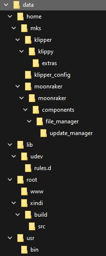
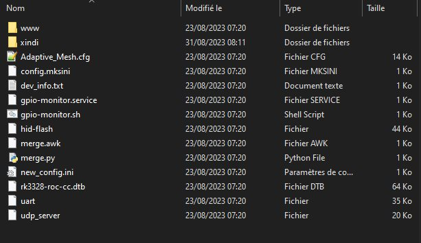

# Mise à jour du système

Aucune notification de la part du système ne nous signale quand / s’il y a une mise à jour disponible.
C’est à l’utilisateur d’aller consulter soit le [Github de la X-Max 3](https://github.com/QIDITECH/QIDI_MAX3/releases), soit [cette page](https://qidi3d.com/pages/software-firmware?z_code=p12711140855145122921) du site QidiTech.

Quelques constats :

- pour des mises à jour, j’ai déjà connu mieux et surtout plus rapide (entre 30 et 40 minutes, en cause la mise à jour de l’écran en mode série (débit lent))
   - => un point que Qiditech devrait améliorer, à mon avis
- cette mise à jour remplace purement et simplement le fichier «printer.cfg» et remets le «moonraker.conf» ainsi que le «config.mksini» originels 
   - => si des modifications y avaient été apportées, elles seront perdues (penser à faire une sauvegarde régulière)
- après cette mise à jour du système, il faut penser à refaire deux étapes d’étalonnage
   - => à cause du point précédent , les paramètres des résultats des calibrations en fin du fichier sont effacés (la section «SAVE_CONFIG DO NOT EDIT» est vide) :
        - topographie du plateau («bed mesh») incluant le réglage du Zoffset qui sera enregistré dans le fichier «config.mksini»,
        - compensation de résonances (Input shaping)
- les paramètres de connexion de l'accès Wifi sont perdus, il faut le reparamétrer (ou utiliser  une connexion Ethernet)
- l’historique des impressions est remis à zéro
   - => ce point là est vraiment «pénible» (faire une sauvegarde du dossier caché `.moonraker_database` du répertoire utilisateur `/home/mks` et le recopier après la mise à jour pour remplacer la base de données de l'historique des impressions qui a été remise à zéro).

## Comment je procède avant de mettre à jour le système

**Avant toute mise à jour**, je sauvegarde via WinSCP:
- le dossier `~/klipper_config`
- le dossier caché `~/.moonraker_database`

Je procède ensuite à la mise à jour du système (fin novembre 2023, V4.3.12) via la clé USB dans laquelle le dossier QD_Update et son contenu ont été copié à la racine de la clé «sans nom» :smirk: .

Via ssh, en tant qu'utilisateur `mks`, j'arrête les services `moonraker` et `klipper` et fais une copie du nouveau `printer.cfg`

```
sudo systemctl stop moonraker
sudo systemctl stop klipper
cp ~/klipper_config/printer.cfg ~/klipper_config/printer-qidi-v4310.cfg
```

Via WinSCP, je recopie le dossier  `~/.moonraker_database` dans le home de mks, idem pour le dossier `klipper_config`

Via ssh :

- par précaution, on réattribue les fichiers de ce dossier à l'utilisateur mks (groupe mks)

```
sudo chown mks:mks ~/.moonraker_database
```

- on relance les services 

```
sudo systemctl start moonraker
sudo systemctl start klipper
```

Je cherche les modifications apportées au fichier printer.cfg (diff, Winmerge) et les reporte manuellement dans mon printer.cfg sauvegardé si nécessaire.

### Alternative pour l'historique des impressions

[voir ici](./sauvegarder_bdd_moonraker.md)

## Examen rapide des fichiers constituants une mise à jour

L'archive QD_Update.zip (version 4.3.8) contient trois fichiers :
1. `printer.cfg`, le fichier de configuration de l'imprimante regroupant à la fois les paramètres matériels et les macros Qidi
2. `QD_Max_SOC` (lui même une archive que 7Zip (et autres logiciels de même fonctionnalité) peut ouvrir)
3. `QD_Max3_UI5.0` est le firmware de l'écran tactile, c'est lui qui prend autant de temps à être flashé en mode série

Comme vu plus haut, lors du flashage, le `printer.cfg` est  purement et simplement remplacé par celui de l'archive… ***Rien n'empêche avant la recopie du dossier QD_Update de remplacer le `printer.cfg` par le vôtre*** :smirk:

### QD_Max_SOC

7zip peut décompresser ce «fichier»: il contient une autre archive `data.tar` qui une fois décompressée donne cette arborescence :



#### /usr/bin

Contient un script shell d'auto montage de clé USB : `makerbase-automount`

<details>

```
#!/bin/sh
#$1 = <dev>

# Default options to use for mounting
AUTOMOUNT_OPTS='users'
# Default type to use for mounting
AUTOMOUNT_TYPE='auto'

# Directory to look for type-specific settings
confdir=/etc/makerbase-automount.d

# Directory to use as parent media dir for mountpoints
# mediadir=/media
mediadir=/home/mks/gcode_files

[ $(id -u) != 0 ] && {
    echo "This tool requires root permissions"
    exit 1
}

log() {
    echo "$*" | systemd-cat -p ${loglevel:-info} -t "media-automount"
}

alias debuglog="loglevel=debug log"
alias errorlog="loglevel=err log"

if ! [ "$1" ]
then
    errorlog "missing arguments! a device name must be provided"
    exit 1
else
    dev=/dev/${1##/*/}
fi

#pwtest:dev中没有对应的块文件显示但是挂载点任然存在的情况
if ! [ -b /dev/sda1 ] && [ -d /home/mks/gcode_files/sda1 ]
then
    mountpoint /home/mks/gcode_files/sda1
    if [ $?==0 ]
    then
        umount /dev/sda1
        rmdir /home/mks/gcode_files/sda1
    fi
fi
#本来想写循环，但是实际上应该不会有多次插拔情况，直接多执行两次判断就好
if ! [ -b /dev/sdb1 ] && [ -d /home/mks/gcode_files/sdb1 ]
then
    mountpoint /home/mks/gcode_files/sdb1
    if [ $?==0 ]
    then
        umount /dev/sdb1
        rmdir /home/mks/gcode_files/sdb1
    fi
fi
#pwtest:end


# Check if the device exists, if not but mounted, umount it
if ! [ -b $dev ]
then
    if grep /etc/mtab -qe "^$dev"
    then
        log "$dev device removed, umounting and cleaning $mediadir"
        if umount "$dev"
        then
            exitcode=0
        else
            exitcode=$?
            errorlog "Error umounting $dev errcode:$exitcode"
            errorlog "Command was: umount $dev"
        fi
    else
        # prevent it from failing on nonexistent devices and degrading systemctl boot
        exitcode=0
        errorlog "device doesn't exist anymore or is not a block device: $dev"
    fi

    # cleanup
    for dir in "$mediadir"/*
    do
        # Only clean non active mountpoints that have no /etc/fstab entry
        if [ -d "$dir" ] && ! mountpoint -q "$dir" && awk '$2=="'$dir'"{exit 1}' /etc/fstab; then
            rmdir "$dir"
        fi
    done
    exit $exitcode
fi

# Load additional info for the block device
eval $(blkid -po export $dev)

# Devices with unknown type will be ignored
if [ -z "$TYPE" ]
then
    debuglog "$dev has no known filesystem type, ignoring mount request"
    exit 0
fi

# Check /etc/fstab for an entry corresponding to the device
[ "$UUID" ] && fstab=$(grep /etc/fstab -e "^[^#]*${UUID}") || \
[ "$LABEL" ] && fstab=$(grep /etc/fstab -e "^[^#]*${LABEL}") || \
fstab=$(grep /etc/fstab -e "^[ \t]*$dev[ \t]")

# Don't manage devices that are already in fstab
if [ "$fstab" ]
then
    debuglog "$dev already in /etc/fstab, automount won't manage it: ${fstab#\t}"
    exit 0
fi

# directory name
# AUTOMOUNT_DIR="${mediadir}/${LABEL:-${dev##*/}}.$TYPE"
# AUTOMOUNT_DIR="${mediadir}/${LABEL:-${dev##*/}}"
AUTOMOUNT_DIR="${mediadir}/${1##*/}"

# Avoid conflicts when multiple devices have the same label
if [ -e "$AUTOMOUNT_DIR" ] && mountpoint -q "$AUTOMOUNT_DIR"
then
    dups=$(find "${AUTOMOUNT_DIR}*" -maxdepth 0 -printf '.' | wc -c)
    AUTOMOUNT_DIR="${AUTOMOUNT_DIR}_$((dups+1))"
fi

# Load Filesystem-specific configuration for mounting
if [ -e "$confdir/$TYPE" ]
then
    debuglog "loading configuration for fs type $TYPE"
    . "$confdir/$TYPE"
elif [ -e "$confdir/auto" ]
then
    . "$confdir/auto"
fi


log "mounting device $dev in $AUTOMOUNT_DIR"
mkdir -p "$AUTOMOUNT_DIR"
if mount -t "$AUTOMOUNT_TYPE" -o "$AUTOMOUNT_OPTS" "$dev" "$AUTOMOUNT_DIR"
then
    # Notify
    username="$(ps au | awk '$11 ~ /^xinit/ { print $1; exit }')"
    [ "$username" ] && DISPLAY=:0 runuser -u "$username" xdg-open "$AUTOMOUNT_DIR"
    log "Device successfully mounted: $AUTOMOUNT_DIR"
#    exit 0
else
    errorlog "Mount error: $?"
    errorlog "Command was : mount -t $AUTOMOUNT_TYPE -o $AUTOMOUNT_OPTS $dev $AUTOMOUNT_DIR"

    rmdir "$AUTOMOUNT_DIR"
#    exit 1
fi
```
  
</details>

#### /lib/udev/rules.d

Contient deux règles «udev» déclenchant le montage lors de l'insertion d'une clé USB :
- 60-usbmount.rules
- 99-makerbase-automount.rules

<details>

***60-usbmount.rules***
```
# KERNEL=="sd[a-z]", NAME="%k", SYMLINK+="%k", GROUP="users"

# ACTION=="add", KERNEL=="sd[a-z][0-9]", SYMLINK+="%k", GROUP="users", NAME="%k"

# ACTION=="add", KERNEL=="sd[a-z][0-9]", RUN+="/bin/mkdir -p /home/mks/gcode_files/%k"

# ACTION=="add", KERNEL=="sd[a-z][0-9]", RUN+="/bin/systemd-mount --no-block --collect /dev/%k /home/mks/gcode_files/%k"

# ACTION=="remove", KERNEL=="sd[a-z][0-9]", RUN+="/bin/systemd-umount /home/mks/gcode_files/%k"

# ACTION=="remove", KERNEL=="sd[a-z][0-9]", RUN+="/bin/rm -rf /home/mks/gcode_files/%k"

# mount the device when added
KERNEL=="sd[a-z]*", ACTION=="add",  	RUN+="/usr/bin/systemctl --no-block restart makerbase-automount@%k.service"

# clean up after device removal
KERNEL=="sd[a-z]*", ACTION=="remove",	RUN+="/usr/bin/systemctl --no-block restart makerbase-automount@%k.service"
```

***99-makerbase-automount.rules***
```
# none
```

</details>

#### /root

Remplace quelques fichiers dans le dossier perso de l'utilisateur `root`



#### /home/mks

Écrase en remplaçant certains fichiers du répertoire perso de l'utilisateur `mks` :

1. `klipper` les modifications apportées par Qidi à Klipper
2. `moonraker` les modifications apportées par Qidi à Moonraker
3. `klipper_config` le dossier de configurations de Klipper

##### /home/mks/klipper_config

Remplace la configuration du nivellement adaptatif (en fonction de la taille de l'objet imprimé) `Adaptive_Mesh.cfg` ainsi qu'une sauvegarde de la configuration des paramétres de l'écran `config.mksini.bak`

**NOTE**: ces deux fichiers bien que dans le répertoire perso de «mks» appartiennent à l'utilisateur «root»

##### /home/mks/moontaker/moonraker

Fichiers Python modifiés par Qidi (diffèrent du Moonraker «officiel») :

- `klippy_apis.py`
- `machine.py`
- `components/metadata.py`
- `components/update_manager/update_manager.py`

##### klipper/klippy

Fichiers Python modifiés par Qidi (diffèrent du Klipper «officiel») :

- `gcode.py`
- `klippy.py`
- `mcu.py`
- `extras/force_move.py`
- `extras/probe.py`
- `extras/rpi_temperature.py`
- `extras/x_twist_compensation.py`

Plus d'informations sur les modifications [ici](./git-klipper-moonraker.md)

:smile:
