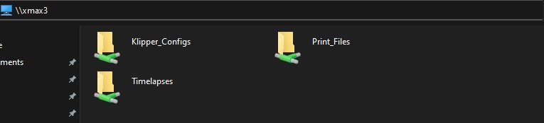
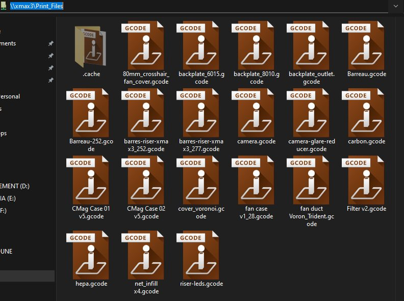
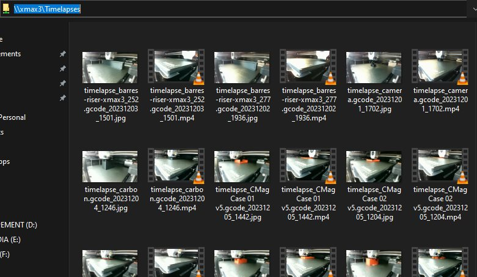
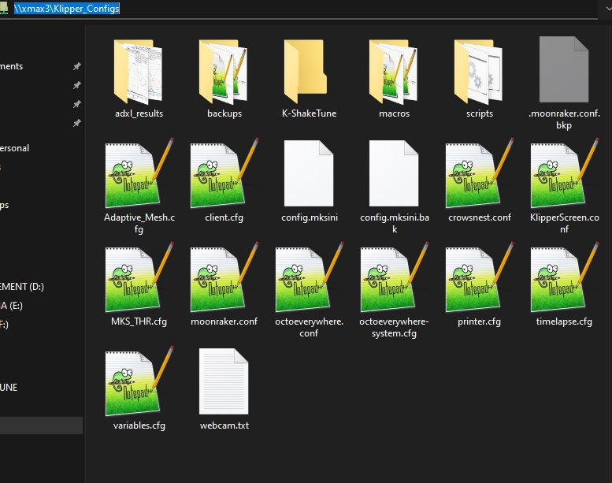

# Accéder à Klipper via le réseau local

## Pourquoi ?

Rendre disponibles les fichiers gcode, les fichiers de configurations de Klipper,
les Timelpases aux explorateurs de fichiers Windows ou Mac via la mise en place d'un partage de fichiers réseau.

## Comment ?

1. Se connecter en ssh sur la carte (utilisateur: **mks**, mot de passe: _makerbase_)
2. Mettre à jour la base de données des paquets :
   ```
   sudo apt update
   ```
3. Installer les paquets nécessaires (ajouter l'option -y pour ne pas avoir à confirmer) :
   ```
   sudo apt install samba winbind
   ```
4. Éditer le fichier de configuration :
   ```
   sudo nano /etc/samba/smb.conf
   ```   
<details><summary>(Clic) ajouter le contenu suivant à la fin du fichier de configuration</summary><p>

  ```
[Print_Files]
comment = GCode_files
path = /home/mks/gcode_files
browseable = Yes
writeable = Yes
only guest = no
create mask = 0777
directory mask = 0777
public = yes
read only = no
force user = mks
force group = mks

[Klipper_Configs]
comment = Klipper configurations
path = /home/mks/klipper_config
browseable = Yes
writeable = Yes
only guest = no
create mask = 0777
directory mask = 0777
public = yes
read only = no
force user = mks
force group = mks

[Timelapses]
comment = Timelapses
path = /home/mks/timelapse
browseable = Yes
writeable = Yes
only guest = no
create mask = 0777
directory mask = 0777
public = yes
read only = no
force user = mks
force group = mks
  ```
</p>
  
</details>

5. Enregistrer les modifications apportées à smb.conf ( <kbd>CTRL</kbd>+<kbd>X</kbd>, <kbd>y</kbd>, <kbd>ENTRÉE</kbd> )


6. Redémarrer le daemon samba (ou redémarrer le système) :
  ```
  sudo systemctl restart smbd
  …
  sudo reboot
  ```

7. Via l'explorateur de fichier d'un PC Windows ou Mac, accéder au partages via l'adresse `\\adr.ess.eip.qidi` ou `\\nom.imprimante`

Exemples avec mon imprimante portant le nom DNS xmax3 :









**ATTENTION**

> Ces partages sont accessibles sans aucune restriction à tous les matériels connectés sur le réseau. A vous de vous documenter si vous voulez
ajouter des restrictions d'accès.
> 
  > Accessibles en _**lecture / écriture**_, les fichiers ajoutés appartiennent à l'utilisateur **mks**, groupe **mks** et
ont le maximum de droits (dossiers compris) : **777**

:smiley:
