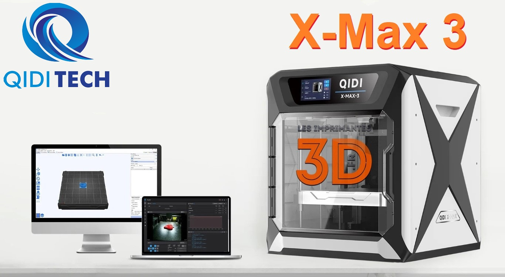

Notes et recherches collectées lors du test de l'imprimante Qidi Tech X-max 3 pour le site français **[lesimprimantes3d.fr](http://www.lesimprimantes3d.fr)** :

- mon parcours lors de [sa découverte](https://www.lesimprimantes3d.fr/forum/topic/54298-la-qidi-tech-x-max-3-revue-d%C3%A9taill%C3%A9e/)
- puis [son test final](https://www.lesimprimantes3d.fr/test-qidi-x-max-3-20231010/)

Ce dépôt regroupe une partie des recherches effectuées lors de ce test.

- le répertoire ***OS*** concerne plutôt le système d'exploitation (Armbian) installé sur la carte clône SKRPI de Makerbase
  - permettre l'[affichage correct des dates et heures système ](./OS/date-heures-synchronisees.md)
  - notes sur la [mise à jour du système](./OS/mise-a-jour-systeme.md)
  - [récupérer de la place](./OS/recuperer-place.md) sur la mémoire de stockage
  - [versions des éléments de base](./OS/git-klipper-moonraker.md)
  - liste des [paquets installés](./OS/paquets-installes.md)
  - incohérences d'attribution des [droits utilisateurs](./OS/droits-utilisateur.md)
  - …
- le répertoire ***Klipper*** concerne les fichiers de configuration du firmware Klipper :
    - le sous-répertoire *QidiConfigurations* regroupe les [fichiers originaux de Qidi Tech](./Klipper/QidiConfigurations.md) **version OS v4.3.8**
    - le sous-répertoire *MyConfiguration* est [mon interprétation](./Klipper/MyConfiguration.md) de la configuration de mon imprimante
    - une analyse sommaire du fichier [printer.cfg](./Klipper/analyse_rapide_printer.cfg.md)
    - le [client](./Klipper/fluidd-mainsail-client.md) Fluidd / Mainsail
    - …
- le répertoire ***Upgrades*** regroupe des «*améliorations*» possibles :
    - ajouter une [caméra USB](./Upgrades/camera.md)
    - ajouter la configuration des [timelapses](./Upgrades/timelapse.md), une fois une caméra installée
    - ajouter la possiblité d'utiliser des scripts shell [Gcode Shell Command](./Upgrades/gcode_shell_command.md)
    - afficher les [températures](./Upgrades/afficher-temperatures-mcu-rk3328.md) du processeur (RK3328) et du contrôleur (STM32) dans l'interface Fluidd
    - [remplacer l'eMMC](./Upgrades/remplacer_eMMC.md) originelle par une de plus grande capacité
    - [OctoEverywhere](./Upgrade/octoeverywhere.md) surveiller l'imprimante et détecter de possibles problèmes
    - [Crowsnest](./Upgrades/crowsnest-legacy.md) meilleure gestion des caméras
    - …
- le répertoire ***Trancheur*** concerne le trancheur QidiSlicer, dérivé de PrusaSlicer :
    - prendre en compte la chauffe de l' [enceinte](./Trancheur/M141.md)
    - …

Sans oublier [quelques commandes Linux utiles](./commandes-linux.md)

:smiley:
