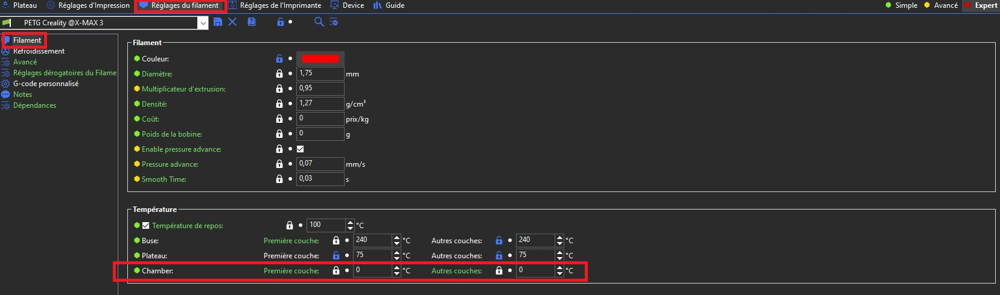

## Prendre en compte la mise en chauffe de l'enceinte

La macro M141 permet de régler la température de la chambre de l'imprimante.

Qidi Tech la règle toujours sur 0 dans l'onglet «Réglages de l'imprimante» / «G-code personnalisé» :

```
PRINT_START
G28
M141 S0
G0 Z50 F600
M190 S[first_layer_bed_temperature]
G28 Z
G29 ; mesh bed leveling ,comment this code to close it
G0 X0 Y0 Z50 F6000
M109 S[first_layer_temperature]
M106 P3 S255
M83
G0 X{max((min(print_bed_max[0], first_layer_print_min[0] + 80) - 85),0)} Y{max((min(print_bed_max[1], first_layer_print_min[1] + 80) - 85),0)} Z5 F6000
G0 Z0.2 F600
G1 E3 F1800
G1 X{(min(print_bed_max[0], first_layer_print_min[0] + 80))} E{85 * 0.04} F3000
G1 Y{max((min(print_bed_max[1], first_layer_print_min[1] + 80) - 85),0) + 2} E{2 * 0.04} F3000
G1 X{max((min(print_bed_max[0], first_layer_print_min[0] + 80) - 85),0)} E{85 * 0.04} F3000
G1 Y{max((min(print_bed_max[1], first_layer_print_min[1] + 80) - 85),0) + 85} E{83 * 0.04} F3000
G1 X{max((min(print_bed_max[0], first_layer_print_min[0] + 80) - 85),0) + 2} E{2 * 0.04} F3000
G1 Y{max((min(print_bed_max[1], first_layer_print_min[1] + 80) - 85),0) + 3} E{82 * 0.04} F3000
G1 X{max((min(print_bed_max[0], first_layer_print_min[0] + 80) - 85),0) + 12} E{-10 * 0.04} F3000
G1 E{10 * 0.04} F3000
```

Puisque la X-Max 3 possède une chambre chauffante, la température de la chambre définie dans la configuration du filament peut être prise en compte.

Il suffit de modifier la ligne commençant par M141 ( `M141 S0` ) par ce qui suit
```
M141 S[first_layer_volume_temperature] ;set chamber temp as defined for first layer

ou

M141 S[volume_temperature] ;set chamber temp as defined for other layers

```

Ainsi, maintenant l'imprimante utilisera les paramètres de température de la chambre définis dans l'onglet «Réglages du filament» / «Filament» => Températures :


