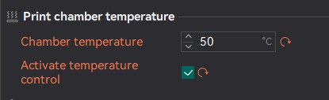

## Température de l'enceinte (chambre)

OrcaSlicer utilise la commande M141/M191 pour contrôler le chauffage actif de la chambre.

Quand l'option «Activer le contrôle de la température» est cochée, OrcaSlicer insère la commande M191 au début du code G (avant le Gcode de la machine).


Remarque : la QIDI X-Max 3 est équipée d'un ventilateur auxiliaire, OrcaSlicer activera automatiquement le ventilateur pendant la période
de chauffage afin d'aider à faire circuler l'air dans l'enceinte fermée.

Deux variables de température de la chambre sont utilisables dans le Gcode de la machine pour contrôler la température de la chambre :
- Pour accéder à la température de la chambre définie dans le premier filament :
  `M191 S{chamber_temperature[0]}`
- Pour utiliser la température globale de la chambre :
  `M191 S{overall_chamber_temperature}`

Deux macros permettent de contrôler le chauffage actif de la chambre :
```
#[heater_generic hot]
[heater_generic chamber]
heater_pin:PB10
max_power:1.0
# Orca note: here the temperature sensor should be the sensor you are using for chamber temperature, not the PTC sensor
sensor_type:NTC 100K MGB18-104F39050L32
sensor_pin:PA1
control = pid
pid_Kp = 63.418 
pid_ki = 0.960
pid_kd = 1244.716
min_temp:0
max_temp:70

[gcode_macro M141]
gcode:
    SET_HEATER_TEMPERATURE HEATER=chamber TARGET={params.S|default(0)}

[gcode_macro M191]
gcode:
    
    
        # If target temperature is 0, do nothing
        M117 Chamber heating cancelled
    
        SET_HEATER_TEMPERATURE HEATER=chamber TARGET={s}
        # Orca: uncomment the following line if you want to use heat bed to assist chamber heating
        # M140 S100
        TEMPERATURE_WAIT SENSOR="heater_generic chamber" MINIMUM={s-1} MAXIMUM={s+1}
        M117 Chamber at target temperature
    

```

###
Source: [Chamber_heater](https://github.com/SoftFever/OrcaSlicer/wiki/Chamber-temperature)
