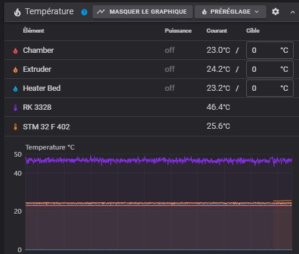

Il est possible d'afficher les températures du contrôleur Rockchip (RK3328), celle du microcontrôleur (MCU) de la carte de l'imprimante et celle du RP2040 sur la carte fille de la tête d'impression
=> voir [ici](https://www.klipper3d.org/fr/Config_Reference.html#capteur-de-temperature-integre-au-microcontroleur) )

Ajouter dans le printer.cfg :
```
#==================  Temperatures host + μcontroler =================
[temperature_sensor RK3328]
sensor_type: temperature_host
min_temp: 10
max_temp: 75

[temperature_sensor STM32F402]
sensor_type: temperature_mcu
min_temp: 10
max_temp: 75

[temperature_sensor Toolhead]
sensor_type: temperature_mcu
sensor_mcu: MKS_THR
min_temp: 0
max_temp: 80
```

Ce qui donne (la copie écran date d'avant l'ajout de la carte fille 😏) :


