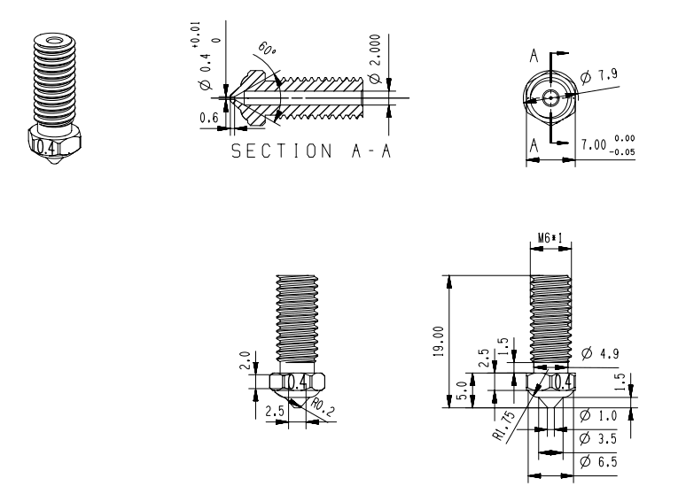
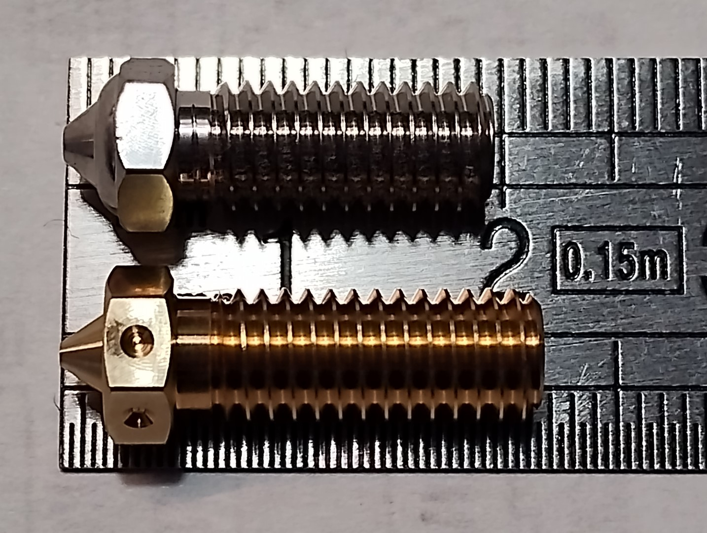

# Buses

## Buses officielles

Qidi a son propre standard de buse (19 mm de longueur) partagé par les trois modèles d'imprimantes: X-Max 3, X-Plus 3 et X-Smart 3.

Les buses Qidi sont 2mm plus courtes (19 mm) que les buses Volcano (21 mm) :

En haut une buse Qidi, au-dessous une buse Volcano :

Le site de Qidi Tech les vend sur sa boutique, Aliexpress et Amazon :
- [Buse plaquée cuivre](https://qidi3d.com/collections/x-max-3-accessories/products/x-max-3-x-plus-3-x-smart-3-copper-plated-nozzle)
- [Buse en laiton](https://qidi3d.com/products/x-max-3-x-plus-3-x-smart-3-brass-hot-end-1?variant=41573859786892)
- [Buse en acier trempé](https://qidi3d.com/products/x-max-3-x-plus-3-x-smart-3-hardened-steel-nozzle?variant=41521850384524)
- [Site AliExpress](https://fr.aliexpress.com/item/1005005476021622.html)

## Buses CHT de Kingroon

Ces buses s'adaptent sans aucune modification.
Buses CHT (améliorent le débit) et/ou buses «normales» : [ici](https://fr.aliexpress.com/item/1005006235068336.html)

## Buses V6 avec adaptateur

Triangle-Lab vend un adaptateur pour Qidi. Cet adaptateur permet de monter des buses V6 :
[Adaptateur Triangle-Lab](https://www.trianglelab.net/products/adapters-for-qidi-hotend?VariantsId=11364)

## Buses Volcano

Il est possible d'utiliser des buses Volcano :
- il faut alors imprimer une entretoise pour descendre la sonde de 2 mm 
- l'idéal étant d'imprimer une nouvelle pièce de refroidissement [modèle printables](https://www.printables.com/fr/model/634938-qidi-x-smartplusmax-3-fan-duct-for-volcano-nozzle-/files), de sorte que le ventilateur
de refroidissement de la pièce ne souffle pas directement sur la buse.

Certains utilisateurs rapportent avoir raccourci la buse Volcano de 2 mm pour qu'elle puisse être montée sans modifications.

