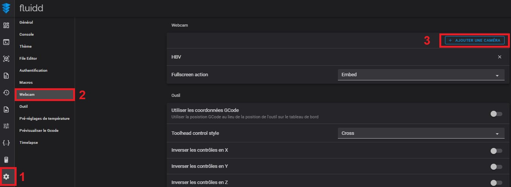
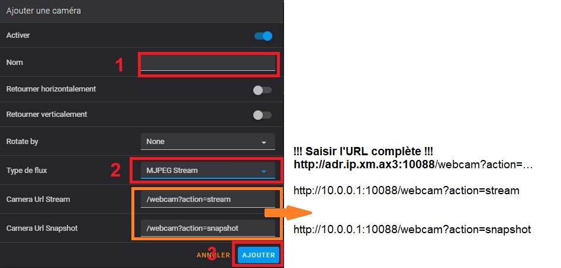
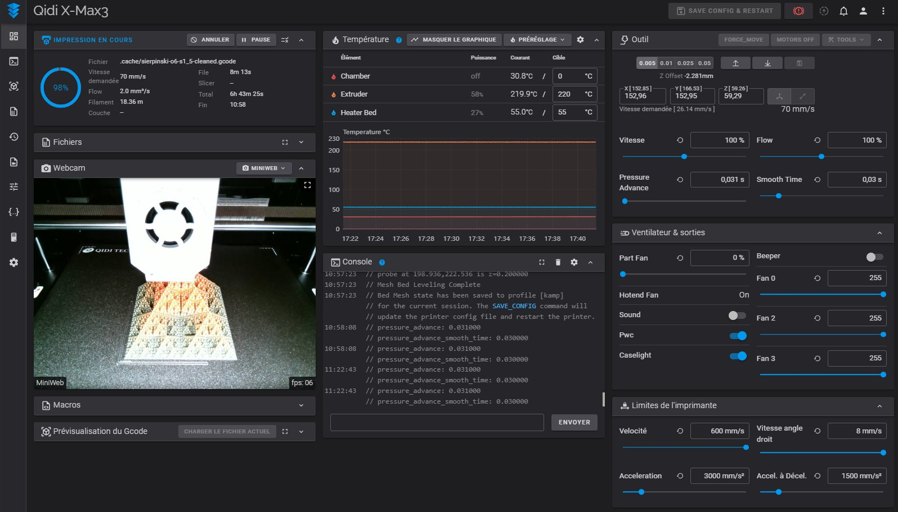

D'origine, la Qidi X-Max 3 n'est pas équipée d'une caméra interne.

Dans l'image du système par défaut, MJPG-Streamer est déjà installé . Il suffira de configurer les paramètres de la caméra sur la page web Fluidd. 

J'ai une caméra inutilisée dans mon stock de matériel pour le cas où ( [ce modèle](https://www.amazon.fr/gp/product/B07WHQYM2W) ).
Il ne lui faut qu' un boitier pour la protéger.
Procrastinateur invétéré, [ce modèle](https://www.printables.com/fr/model/176428-voron-camera-hbv-5640wa) issue d'une recherche sur printables.com me convient.
J'ai juste refait une [autre patte de maintien](../Images/patte_camera.stl) pour intégrér un magnet dans celle-ci.

Un emplacement USB est disponible pour connecter cette Webcam sur la carte contrôleur, le passage du câble USB utilise les découpes présentes dans le boitier.

Les pattes de fixation munies de magnets permettent de fixer la Webcam à l'avant sur la barre métallique qui accueille le bandeau de LEDs.

Dans Fluidd, on configure de la manière suivante :
- Configuration de l'interface web → caméra → ajouter
   
  
- Activer la caméra → configurer le nom → type de flux sélectionner le flux vidéo MJPEG, enregistrer
    

- Revenir à l'interface principale pour visualiser l'image.
   

L'ajout d'une caméra en plus de permettre de visualiser l'impression dans l'interface Web, autorise de l'enregistrement vidéo en ajoutant de quoi faire des [timelapses](https://github.com/fran6p/Qidi_X-Max3/blob/main/Upgrades/timelapse.md) 

### MISE A JOUR

Depuis mi-octobre 2023, Qidi Tech vend [une caméra](https://qidi3d.com/collections/x-max-3-accessories/products/x-max-3-x-plus-3-x-smart-3-camera)
adaptée aux modèles de ses séries «3». Elle se place à l'intérieur de la structure, à l'avant droit.
