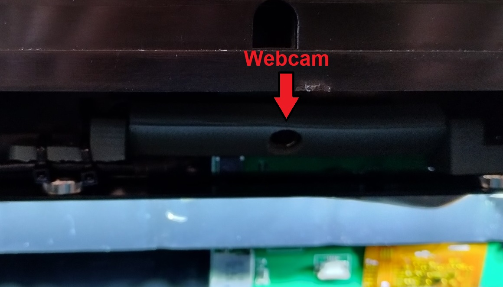

D'origine, la Qidi X-Max 3 n'est pas équipée d'une caméra interne.

J'ai une caméra inutilisée dans mon stock de matériel pour le cas où [ce modèle](https://www.amazon.fr/gp/product/B07WHQYM2W).
Il lui faut simplement un boitier pour la protéger.
Procrastinateur invétéré, ([ce modèle](https://www.printables.com/fr/model/176428-voron-camera-hbv-5640wa)) issue d'une recherche sur printables.com me
convient. Je n'y ai juste apporté qu'une [modification](../Images/patte_camera.stl) aux pattes de fixation pour intégrér un magnet dans celles-ci.

Un emplacement USB est disponible pour connecter cette Webcam sur la carte contrôleur, le passage du
câble USB utilise les découpes présentes dans le boitier.

Les pattes de fixation munies de magnets permettent de fixer la Webcam à l'avant sur la barre métallique
qui accueille le bandeau de LEDs.

L'interface Web, Fluidd, affiche le lfux de celle-ci :

Depuis le mois d'octobre 2023, Qidi Tech propose [une caméra](https://qidi3d.com/collections/x-max-3-accessories/products/x-max-3-x-plus-3-x-smart-3-camera) à placer à l'intérieur de la structure (à l'avant droit).
