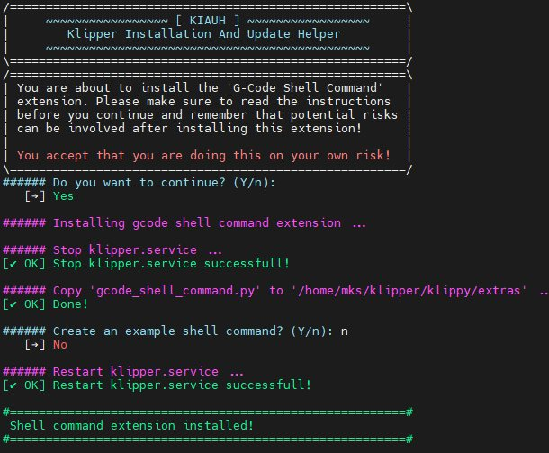

L'utilisateur th33xitus, désormais nommé dw-0, auteur de [KIAUH](https://github.com/th33xitus/kiauh) a créé un module python permettant d'exécuter des scripts shell via des macros Klipper.

## Installation

Plusieurs possibilités d'installation :

    Toutes les manipulations sont effectuées en tant qu'utilisateur «mks»

### KIAUH est présent sur le système

KIAUH est installé dans l'îmage système de Qidi (c'est celle de Makerbase pour leur carte MKS SKIPR).
On peut donc l'utiliser pour installer ce module Python.

A- Exécution du script d'installation :

`~/kiauh/kiauh.sh`


Choisir Option 4 [Advanced]

![Option 4 [Advanced]](../Images/kiauh-2.jpg)

Option 8 [G-Code Shell Command]

![8 [G-Code Shell Command]](../Images/kiauh-3.jpg)

Confirmer (Y) puis saisir le mot de passe de l'utilisateur «mks» (*makerbase*), nécessaire à l'arrêt du service klipper


Ne pas installer les exemples proposés, Qidi utilisant d'anciennes versions de Klipper / Moonraker, le chemin des fichiers de configurations attendu par KIAUH provoque une erreur stoppant l'exécution du script d'installation. Le service klipper ayant été arrêté ne peut pas être relancé à cause de cette erreur. Il faut le relancer manuellement `sudo systemctl start klipper.service`



B- Création d'un lien symbolique :

KIAUH étant installé, on peut créer un lien symbolique dans le répertoire `~/klipper/klippy/extras` :

```
ln -sf "/home/mks/kiauh/resources/gcode_shell_command.py" "/home/mks/klipper/klippy/extras/gcode_shell_command.py"
```

### KIAUH est absent du système

C- Installation du script Python si/quand KIAUH n'est pas installé

1- Se déplacer dans le répertoire d'accueil :

`cd ~/klipper/klippy/extras`

2- Récupération du script :

```
wget "(https://raw.githubusercontent.com/dw-0/kiauh/master/resources/gcode_shell_command.py)"
```

## Utilisation

Ce script ajoute un GCode étendu: **RUN_SHELL_COMMAND** utilisable dans des macros Gcode.

Un fichier shell_command.cfg est ajouté à la configuration via une directive «include» dans le printer.cfg (*je préfère ne pas avoir un gros fichier «printer.cfg» monolithique*). Celui-ci contiendra des sections [gcode_macro] incluant le Gcode étendu `RUN_SHELL_COMMAND`, des macros «shell_command» [gcode_shell_command …] précisant le script shell à utiliser.

Il suffit donc de créer les **macros Gcode**, les **macros Gcode_Shell_command** et les **scripts shell** voulus (et tester ensuite leur bon déroulement).

## Exemples

Exemple extrait de mon fichier shell_command.cfg :

```
…
[gcode_macro PROCESS_SHAPER_DATA]
description: process csv file to png
gcode:
    RUN_SHELL_COMMAND CMD=adxl_x
    RUN_SHELL_COMMAND CMD=adxl_y
 
[gcode_shell_command adxl_x]
command: bash /home/mks/klipper_config/scripts/adxl_x.sh 
timeout: 300.
verbose: True

[gcode_shell_command adxl_y]
command: bash /home/mks/klipper_config/scripts/adxl_y.sh 
timeout: 300.
verbose: True
…
```

Scripts shell exécutés via gcode_shell_command :

```
#!/bin/sh
#
# adxl_x.sh
#
# Create PNG from csv file issued after INPUT_SHAPING, X axis
#

# Paths
#
DATE=$(date +"%Y%m%d")
SCRIPTS="/home/mks/klipper/scripts/calibrate_shaper.py"
CSV_FILE="/tmp/calibration_data_x_*.csv"
PNG_FILE="/home/mks/klipper_config/adxl_results/shaper_calibrate_x_$DATE.png"

$SCRIPTS $CSV_FILE -o $PNG_FILE
```

Le script shell pour l'axe Y peut être déduit du précédent :smirk:

A l'extinction de l'imprimante, le répertoire /tmp est vidé, les fichiers CSV issus des tests de résonances seront perdus. Si on veut pouvoir les réutiliser , il faut les transférer dans un endroit persistant (/home/mks/klipper_config/adxl_results par exemple).

Là encore un script shell permet d'automatiser cette recopie :

```
#!/bin/sh
#
# Backup csv file as they are deleted when printer is powered off (/tmp directory is emptied at poweroff)
#

# Paths
#
CSV_FILE="/tmp/calibration_data_*.csv"
DIR_CONF="/home/mks/klipper_config/adxl_results"

cp $CSV_FILE $DIR_CONF
```

Il suffit de créer une macro Gcode et son pendant shell_command pour pouvoir effectuer la sauvegarde directement via le terminal de Klipper :

```
[gcode_macro BACKUP_CSV]
description: Backup csv files registered in /tmp directory emptied on poweroff
gcode:
    M118 Backup all csv files !
    RUN_SHELL_COMMAND CMD=bkup_csv
    M118 Backup done
    
…
# Sauvegarde des fichiers csv issus de tests de résonance
[gcode_shell_command bkup_csv]
command: bash /home/mks/klipper_config/scripts/backup_csv_files.sh 
timeout: 300.
verbose: True
```

**IMPORTANT** :

Pour pouvoir être utilisés, les scripts shell doivent obligatoirement être au format Unix (terminaison de ligne (LF) ≠ format Windows (CRLF))

Si, par exemple, ols ont été recopiés d'un machine Windows, quand on les testera, une erreur sera remontée. Exemple:
```
// /home/mks/klipper_config/scripts/clean_backups.sh: line 2: $'\r': command not found
// /home/mks/klipper_config/scripts/clean_backups.sh: line 20: $'\r': command not found
// /home/mks/klipper_config/scripts/clean_backups.sh: ./home/mks/klipper_config/scripts/move_files.sh: /bin/bash^M: bad interpreter: No such file or directory
```

Un utilitaire Unix très pratique `dos2unix` permet de remédier à ce soucis. Il suffit juste de l'installer sur le système :
```
mks@mkspi:~/klipper_config/scripts$ sudo apt install dos2unix
mks@mkspi:~/klipper_config/scripts$ cd ~/klipper_config/scripts
mks@mkspi:~/klipper_config/scripts$ file adxl_x.sh
adxl_x.sh: Bourne-Again shell script, ASCII text executable, with CRLF line terminators
mks@mkspi:~/klipper_config/scripts$ dos2unix *
dos2unix: converting file adxl_x.sh to Unix format...
dos2unix: converting file adxl_y.sh to Unix format...
dos2unix: converting file autocommit.sh to Unix format...
dos2unix: converting file backup_csv_files.sh to Unix format...
dos2unix: converting file clean_backups.sh to Unix format...
dos2unix: converting file datetime.sh to Unix format...
dos2unix: converting file fix_OS_stuff.sh to Unix format...
dos2unix: converting file fix_scripts.sh to Unix format...
dos2unix: converting file graph_vibrations.py to Unix format...
dos2unix: converting file mcu_timing.sh to Unix format...
dos2unix: converting file move_files.sh to Unix format...
dos2unix: converting file plot_graphs.sh to Unix format...
mks@mkspi:~/klipper_config/scripts$ file adxl_x.sh
adxl_x.sh: Bourne-Again shell script, ASCII text executable
``̀

:smiley:
