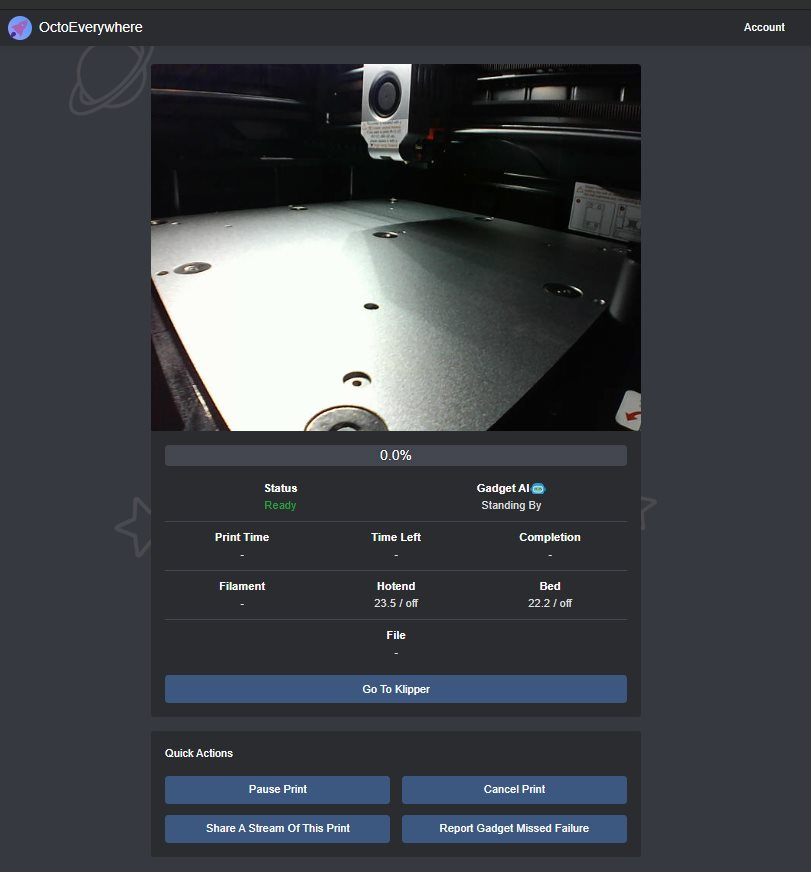

# OctoEverywhere

L'installation d'**[OctoEeverywhere](https://github.com/QuinnDamerell/OctoPrint-OctoEverywhere)** est très simple. KIAUH étant installé sur le système, il suffit de passer par son intermédiaire :smirk:

1. Se connecter en ssh, utilisateur **mks**
2. Lancer KIAUH `./kiauh/kiauh.sh`
3. Choix (1) [Install]
4. Saisir le mot de passe de l'utilisateur **mks** ( ***makerbase*** )
5. Choix (10) [OctoEverywhere]


```
/=======================================================\
|     ~~~~~~~~~~~~~~~~~ [ KIAUH ] ~~~~~~~~~~~~~~~~~     |
|        Klipper Installation And Update Helper         |
|     ~~~~~~~~~~~~~~~~~~~~~~~~~~~~~~~~~~~~~~~~~~~~~     |
\=======================================================/

###### Initializing OctoEverywhere for Klipper installation ...
OctoEverywhere is already installed.
It is safe to run the install again to repair any issues or if the printer isn't linked, run the printer linking logic again.

###### Do you want to run the OctoEverywhere recovery or linking logic again? (Y/n):
   [➔] Yes

###### Checking for the following dependencies:
● git
● dfu-util
● virtualenv
● python3
● python3-pip
● python3-venv
[✓ OK] Dependencies already met!

###### Cloning OctoEverywhere from https://github.com/QuinnDamerell/OctoPrint-OctoEverywhere.git ...
Cloning into '/home/mks/octoeverywhere'...
remote: Enumerating objects: 1570, done.
remote: Counting objects: 100% (833/833), done.
remote: Compressing objects: 100% (294/294), done.
remote: Total 1570 (delta 641), reused 687 (delta 539), pack-reused 737
Receiving objects: 100% (1570/1570), 670.19 KiB | 3.25 MiB/s, done.
Resolving deltas: 100% (1056/1056), done.
instance_cfg_dirs[0]


@@@@@@@@@@@@@@@@@@@@@@@@***@@@@@@@@@@@@@@@@@@@@@@@
@@@@@@@@@@@@@@***********************@@@@@@@@@@@@@
@@@@@@@@@@*******************************@@@@@@@@@
@@@@@@@@***********************************@@@@@@@
@@@@@,,,************************/////////*****@@@@
@@@@,,,,,,*****************//////////////******@@@
@@,,,,,,,,,,***********//////////////////*******@@
@@,,,,,,,,,,,,*******////////****///////*********@
@,,,,,,,,,,,/////////////////****//////***********
@,,,,,,,//////////////////////////////************
,,,,,,,,////////////////////////////**************
@,,,,,,,,,,,,/////////////////////****************
@,,,,,,,,,,,,,,/////////////////******************
@@,,,,,,,,,,,,,,,,//////////////*****************@
@@@,,,,,/#######,,,,///////////*****************@@
@@@@,,,##########,,,,,,,//////,****************@@@
@@@@@,##########,,,,,,,,,////,,,,*************@@@@
@@@@@########,,,,,,,,,,,,//,,,,,,,,********@@@@@@@
@@@@@#@@@@,,,,,,,,,,,,,,,,,,,,,,,,,,,***,@@@@@@@@@
@@@@@@@@@@@@@@@,,,,,,,,,,,,,,,,,,,,,@@@@@@@@@@@@@@

           OctoEverywhere For Klipper


OctoEverywhere empowers the worldwide maker community with...
  - Free & Unlimited Mainsail and Fluidd Remote Access
  - Free & Unlimited Next-Gen AI Print Failure Detection
  - Real-Time Print Notifications
  - And So Much More


Checking required system packages are installed...
You might be asked for your system password - this is required to install the required system packages.
Mon 13 Nov 2023 04:28:51 PM CET
Hit:1 http://deb.debian.org/debian buster InRelease
Hit:2 http://deb.debian.org/debian buster-updates InRelease
Hit:3 http://deb.debian.org/debian buster-backports InRelease
Hit:4 http://security.debian.org buster/updates InRelease
Hit:5 http://armbian.hosthatch.com/apt buster InRelease
Reading package lists... Done
Building dependency tree
Reading state information... Done
198 packages can be upgraded. Run 'apt list --upgradable' to see them.
Reading package lists... Done
Building dependency tree
Reading state information... Done
python3-pip is already the newest version (18.1-5).
virtualenv is already the newest version (15.1.0+ds-2+deb10u1).
python3 is already the newest version (3.7.3-1).
curl is already the newest version (7.64.0-4+deb10u7).
0 upgraded, 0 newly installed, 0 to remove and 198 not upgraded.
Ensuring zlib is install for Pillow, it's ok if this package install fails.
Reading package lists... Done
Building dependency tree
Reading state information... Done
zlib1g-dev is already the newest version (1:1.2.11.dfsg-1+deb10u2).
0 upgraded, 0 newly installed, 0 to remove and 198 not upgraded.
Reading package lists... Done
Building dependency tree
Reading state information... Done
System package install complete.
Checking Python Virtual Environment For OctoEverywhere...
Updating PIP if needed... (this can take a few seconds or so)
Requirement already satisfied: pip in ./octoeverywhere-env/lib/python3.7/site-packages (23.3.1)
Installing or updating required python libs...
Python libs installed.
Bootstrap done. Starting python installer...
Os Type Detected: OsTypes.Debian

Moonraker config path [/moonraker.conf] was given, but no found pair matched it.
Only one moonraker instance was found, so we are using it! [moonraker.service:/home/mks/klipper_config/moonraker.conf]
Starting configuration...
Enuring path and permissions [/home/mks/octoeverywhere-store]...
Dir already exists.
Setting owner permissions to the service user [mks]...
Directory setup successfully.
Configured. Service: octoeverywhere, Path: /etc/systemd/system/octoeverywhere.service, LocalStorage: /home/mks/octoeverywhere-store, Config Dir: /home/mks/klipper_config, Logs: /home/mks/klipper_logs
Starting Web Interface Setup

A web interface is already setup:
Fluidd on port 10088

Do you want to keep this setup? [y/n] y
Setting Up OctoEverywhere's System Service...
Service file already exists, recreating.
Creating service file /etc/systemd/system/octoeverywhere.service...
Registering service...
Starting service...
Service setup and start complete!
Waiting for the plugin to produce a printer id... (this can take a few seconds)

This printer isn't connected to an OctoEverywhere account.
Would you like to link it now? [y/n] y


You're 10 seconds away from free and unlimited printer access from anywhere!
To securely link this printer to your OctoEverywhere account, go to the following website and use the code.

Website: https://octoeverywhere.com/code
Code:    ******


Waiting for the printer to be linked to your account...

Success! This printer is securely connected to your account as 'X-Max3'


        ~~~ OctoEverywhere For Klipper Setup Complete ~~~
  You Can Access Your Printer Anytime From OctoEverywhere.com
                   Welcome To Our Community
                            <3
```

Je peux désormais accéder à mon imprimante en me connectant à [](https://octoeverywhere.com/dashboard)


