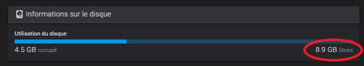

## Remplacement eMMC 8Go par une 16Go

D'origine, la carte eMMC installée sur la carte Qidi MKS SKIPR possède une petite capacité (8 Go). En plus l'image du système d'exploitation
(Armbian) est une version «Desktop» dont un bon nombre de packages occupe de la place.

Makerbase propose une eMMC de capacité identique. En cherchant un peu sur Internet, des eMMC de capacités supérieures (16 Go+) peuvent être trouvées.

Mon choix s'est porté sur [celle-ci](https://fr.aliexpress.com/item/4001208491195.html) de 16 Go.
Malheureusement je n'en ai pas trouvé d'identique à celle de MKS avec ses deux fixations pour maintenir l'eMMC sur la carte. Une petite modélisation permettra d'imprimer une pièce permettant de la maintenir un peu mieux.

Après quelques semaines de délais, le temps que ce composant arrive «*à pieds par la Chine*», le facteur l'a déposé dans la boite à lettres.

Retrait du capot arrière avec ses huit (8) vis de maintien (clé Allen de 2), dévissage des deux (2) vis de fixation de l'eMMC sur la carte (vis cruciforme).
Retrait de l'eMMC originelle pour pouvoir en faire une image système qui sera ensuite «gravée» sur la nouvelle eMMC de 16 Go.

## Les étapes

### imager le système originel

Sous Windows, j'utilise depuis longtemps un outil fort pratique : [imageUSB](https://www.osforensics.com/tools/write-usb-images.html)

1. créer l'image complète en la sauvegardant à un endroit approprié
2. «graver» cette image sur la nouvelle eMMC
3. Installer cette nouvelle eMMC sur la carte contrôleur
4. Allumer l'imprimante pour vérifier que cette image démarre correctement.

### Accéder en ssh en root

Vérifier l'occupation des partitions :

`df -h`

L'image correspond encore à une carte 8 Go

Obtenir les informations du partitionnement de cette carte :

`fdisk -l /dev/mmcblk1`

On passe aux choses sérieuses :

- fdisk permet de modifier la table de partitionnement :

  `fdisk /dev/mmcblk1`
  
  - p
    => affiche la table actuelle et noter le début de la seconde partition (mmcblk1p2), celle correspond à la racine (/)
  - d
    => détruire la seconde partition (dans ce cas, seul l'enregistrement concernant la partition est supprimé, les données elles-mêmes restent sur le disque !
  - n
    => créer une nouvelle partition primaire débutant à l'emplacement noté, de la taille maximum (ou moins)
  - préserver le type de la partition (ext4)
  - w
    => écrire la nouvelle table
- touch /forcefsck
  => forcer une vérification du système de fichier au redémarrage
- shutdown -r now
  => redémarrer
- laisser un peu de temps à ce redémarrage
- resize2fs /dev/mmcblk1p2
  => informer le système de fichier de ce changement de taille
- shutdown -r now
  => redémarrer une dernière fois
  Avec la Qidi X-Max 3, il est préférable d'éteindre complètement l'imprimante, attendre au moins 30 s avant de redémarrer (le temps que le super condenstaur se décharge)!
- df -h
  => vérifier que le système dispose désormais de plus de place et profiter

  
