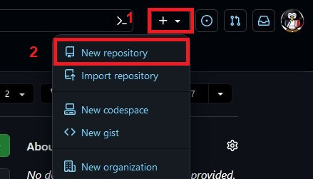
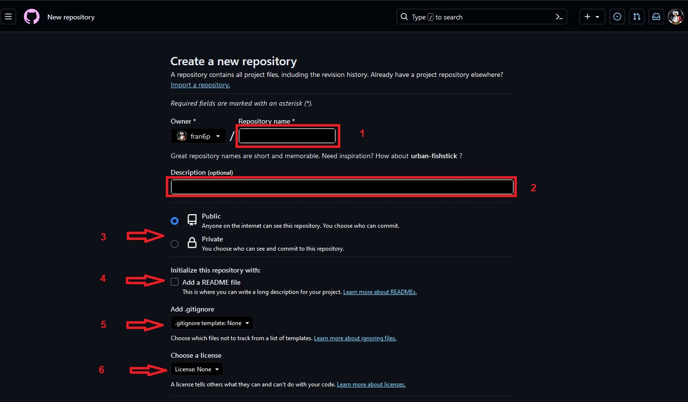
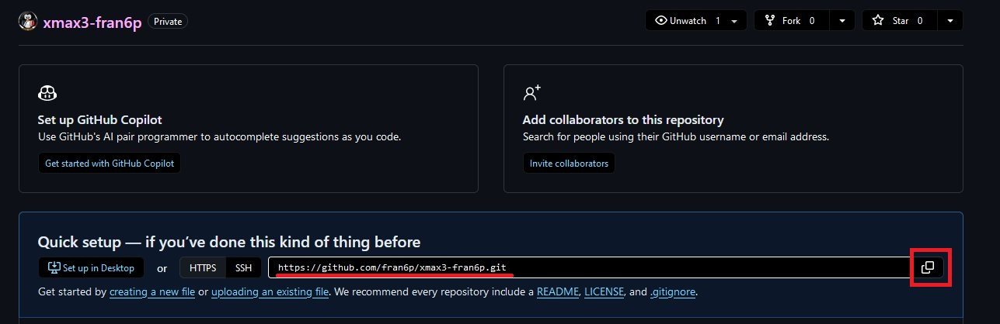
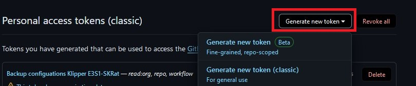
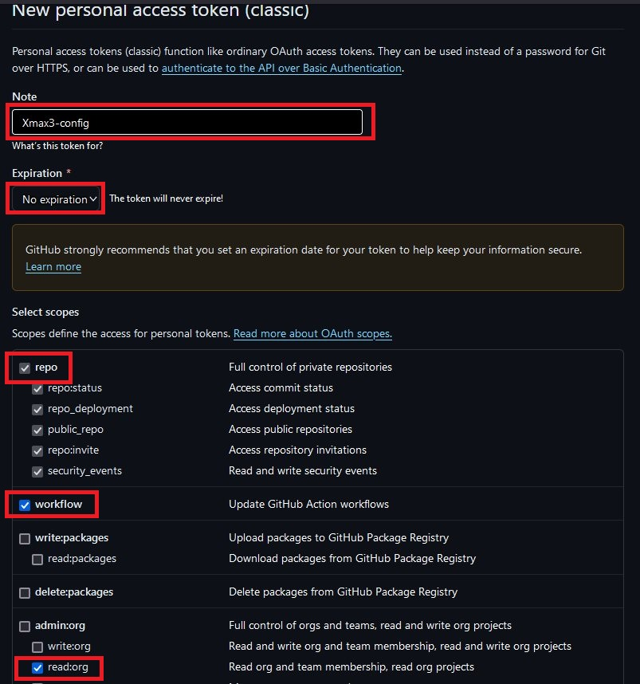
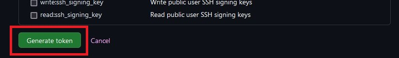

# Sauvegarder la configuration

## Préalable

> Posséder un dépôt Github
>> Créer un compte Github. Si ce n'est pas déjà fait [cliquer ici](https://github.com/).

- Se connecter sur son compte Github
- Créer un nouveau dépôt
   


- Compléter le formulaire
  


  - utiliser un nom explicite n'utilisant que les caractères ASCII (a-zA-Z0-9) sans espace (à remplacer par le souligné (_) ou le tiret (-) ).
  - la description bien qu'optionnelle est chaudement recommandée
  - public / privé (au choix)
  - Options «Initialize this repository with»
    - pas d'ajout de README
	- «none» pour .gitignore
	- «none» pour la licence
- Valider la création du dépôt en cliquant [Create repository]
- Copier l'adresse du dépôt
  


## Cloner [ce dépôt](https://github.com/Staubgeborener/klipper-backup)

- Se connecter en ssh, utilisateur **mks**, mot de passe **makerbase**

```
git clone https://github.com/Staubgeborener/klipper-backup.git && chmod +x ./klipper-backup/script.sh && cp ./klipper-backup/.env.example ./klipper-backup/.env
```
- Editer le fichier .env
```
cd ~/klipper-backup
nano .env
```
- remplacer USERNAME par le nom de l'utilisateur du dépôt Github et REPOSITORY par l'adresse du nouveau précédemment copiée :
```
 github_token=ghp_xxxxxxxxxxxxxxxxxxxx
 github_username=USERNAME
 github_repository=REPOSITORY
```
Reste à obtenir un jeton GitHub (classique ou à grain fin, l'un ou l'autre fonctionne), s'assurer d'avoir un accès au dépôt ainsi que les permissions de pousser/tirer/commettre (push/pull/commit).

## Créer un jeton Github

Ce jeton sera utilisé pour s'authentifier auprès du dépôt nouvellement créé.

- [cliquer ici](https://github.com/settings/tokens) pour accéder aux paramètres des jetons d'accès personnels (***il faut évidemment être connecté pour y accéder***).

- créer un nouveau jeton
  


- compléter le formulaire
  


- valider
  



> ATTENTION!
> 
> Bien noter le jeton d'accès, car une fois la fenêtre fermée, on ne peut plus le récupérer et il faut alors en créer un nouveau.

- compléter l'édition du fichier **.env** en remplaçant "ghp_xxxxxxxxxxxxxxxxxxxx" par le token nouvellement créé.
- QIDI utilisant le dossier "klipper_config" pour stocker les fichiers de configuration, modifier le chemin du paramètre "path_klipperdata"
- enregistrer les modifications via un CTRL+X, Yes, ENTRÉE

## Utilisation

Le fichier .env étant complété, le dépôt créé, toujours connecté en ssh, lancer le script "script.sh" du dossier "klipper-backup"
```
./script.sh
```
Vérifier qu'aucune erreur ne remonte puis consulter le dépôt pour voir le commit.

